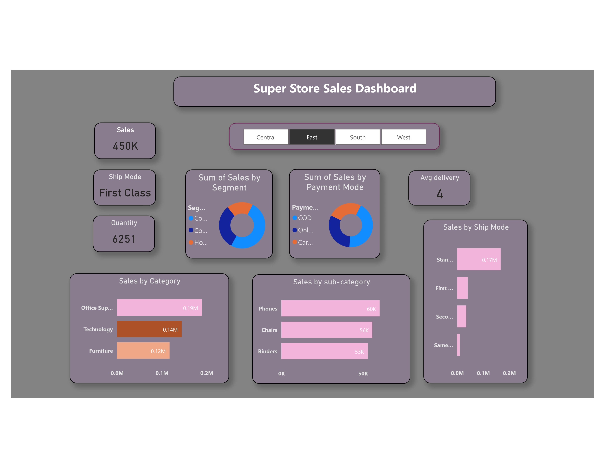
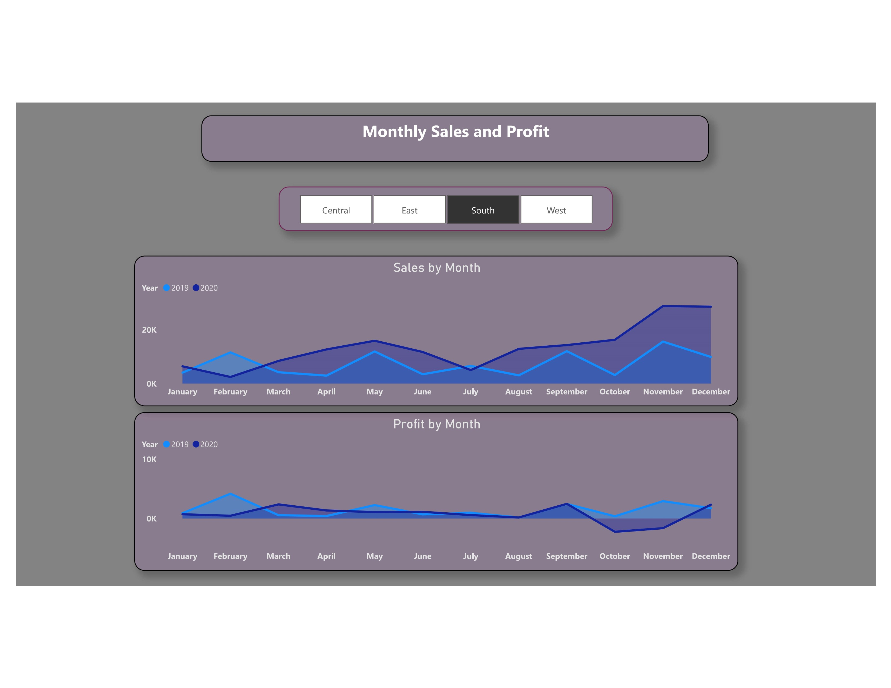
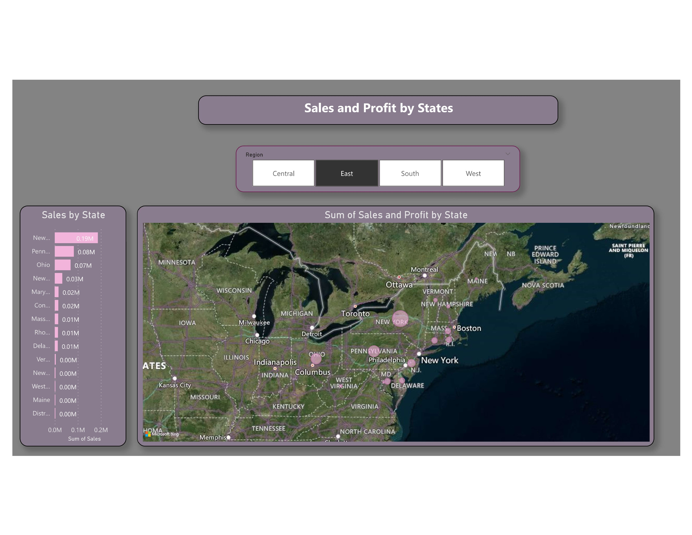
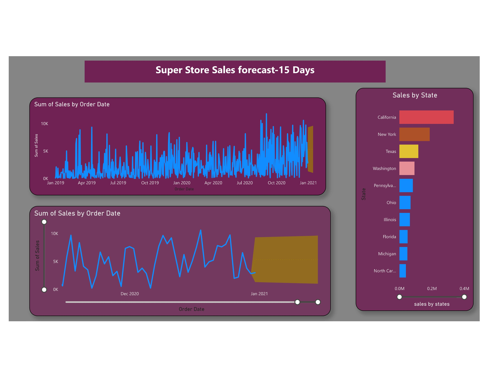

# Super Store Sales Analysis with Power BI

## Table of Contents

- [Introduction](#introduction)
- [Data Source and Preparation](#data-source-and-preparation)
- [Key Insights Derived](#key-insights-derived)
- [Power BI Dashboards Explained](#power-bi-dashboards-explained)
- [Conclusion](#conclusion)
- [Tools and Technologies](#tools-and-technologies)

## Introduction

This project presents a detailed sales analysis for the Super Store using Microsoft Power BI. Through an interactive dashboard, the aim is to better understand sales patterns, identify high-performing products, and highlight potential areas for growth.

## Data Source and Preparation

The data for this project has been sourced from the Super Store's sales database. Before importing the data into Power BI, it was cleaned and transformed using SQL to ensure consistency and accuracy.

## Key Insights Derived

From our analysis, we discovered:
- The Technology category was the most profitable.
- Sales peaked during November and December.
- The West region showed the most promise in terms of growth.

## Power BI Dashboards Explained

1. **Super Store Sales Dashboard**: This provides an overview of total sales, segmented by shipping mode, product category, and customer segment.
   
   
2. **Monthly Sales and Profit**: This chart shows the monthly trend of sales and profits over the last two years.
   
   
3. **Sales and Profit by States**: A geographical representation of sales and profits by state, providing a visual representation of regional performance.
   

   

## Conclusion

The Power BI dashboard provides valuable insights into the sales patterns of the Super Store. By focusing on high-performing categories and expanding in promising regions, the Super Store can enhance its profitability and growth.

## Tools and Technologies

- **Power BI**: Used for data visualization and dashboard creation.
- **SQL**: Used for data preparation and transformation.
- **Excel**: Assisted in preliminary data analysis.

